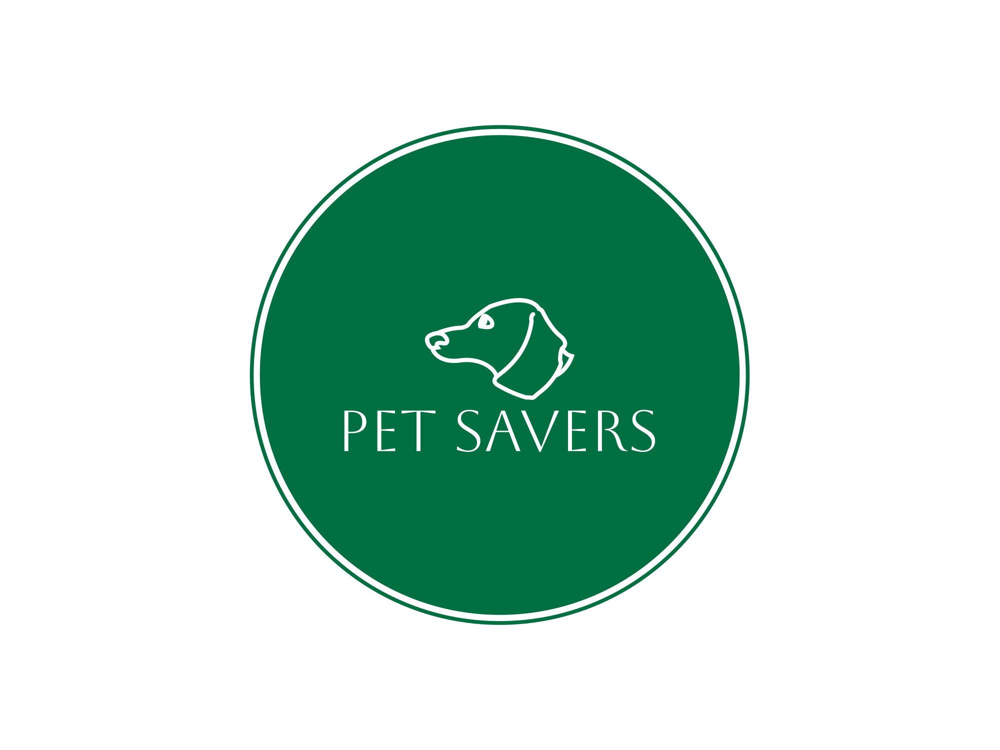

<h1 align="center">Pet Savers</h1>

  <p align="center">
  <a href="https://github.com/ori-123/petsaversmern">
    
  </a>
  </p>

<h2 id="about-the-project">About The Project</h2>

The website and content management system of an imaginary dog shelter. Employees can upload, change and delete information about
pets at the shelter, while visitors can browse this information and express interest in adopting dogs.

This little project serves as a showcase of proficiency in the MERN stack. It uses an in-memory Mongo database for ease of access and
presentation purposes, an Express webserver and a React frontend with some rudimentary CSS. It populates the database with some dummy data
on startup.

<details>
  <summary>Table of Contents</summary>
  <ol>
    <li>
      <a href="#about-the-project">About The Project</a>
      <ul>
        <li><a href="#built-with">Built With</a></li>
      </ul>
    </li>
     <li>
       <a href="#getting-started">Getting Started</a>
      <ul>
      <li><a href="#prerequisites">Prerequisites</a></li>
     </li>
    <li><a href="#contributing">Contributing</a></li>
    <li><a href="#contact-author">Contact Author</a></li>
  </ol>
</details>

<h3 id="built-with">Built With</h3>

* [![React][React.js]][React-url]
* [![Express][Express.js]][Express-url]
* [![MongoDB][MongoDB]][Mongo-url]
* [![Node][Node.js]][Node-url]

<p align="right">(<a href="#about-the-project">back to top</a>)</p>

<h2 id="getting-started">Getting Started</h2>

```
cd backend
npm i
npm run dev
cd frontend
npm i
npm run dev
```

The default "/" route is the public page, use "/admin" for employee mode.

<h3 id="prerequisites">Prerequisites</h3>

* npm
  ```sh
  npm install npm@latest -g
  ```

<p align="right">(<a href="#about-the-project">back to top</a>)</p>

<h2 id="contributing">Contributing</h2>

Contributions are what make the open source community such an amazing place to learn, inspire, and create. Any
contributions you make are **greatly appreciated**.

If you have a suggestion that would make this application better, please fork the repo and create a pull request.

1. Fork the Project
2. Create your Feature Branch (```git checkout -b feature/AmazingFeature```)
3. Commit your Changes (`git commit -m 'Add some AmazingFeature'`)
4. Push to the Branch (`git push origin feature/AmazingFeature`)
5. Open a Pull Request

<p align="right">(<a href="#about-the-project">back to top</a>)</p>

<h2 id="contact-author">Contact Author</h2>

### Oresztész Fokasz (Ori)

[![Github Pages]](https://github.com/ori-123/) 
[![LinkedIn]](https://www.linkedin.com/in/ori-fokas/) 
[![Gmail]](mailto:fokaszo@gmail.com)

<p align="right">(<a href="#about-the-project">back to top</a>)</p>

<!-- MARKDOWN LINKS & IMAGES -->

[React.js]: https://img.shields.io/badge/React-20232A?style=for-the-badge&logo=react&logoColor=61DAFB
[React-url]: https://reactjs.org/
[Express.js]: https://img.shields.io/badge/Express.js-404D59?style=for-the-badge
[Express-url]: https://expressjs.com/
[MongoDB]: https://img.shields.io/badge/MongoDB-4EA94B?style=for-the-badge&logo=mongodb&logoColor=white
[Mongo-url]: https://www.mongodb.com/
[Node-url]: https://nodejs.org/en
[Node.js]: https://img.shields.io/badge/Node.js-43853D?style=for-the-badge&logo=node.js&logoColor=white

[Github Pages]: https://img.shields.io/badge/github-121013?style=for-the-badge&logo=github&logoColor=white
[LinkedIn]: https://img.shields.io/badge/LinkedIn-0077B5?style=for-the-badge&logo=linkedin&logoColor=white
[Gmail]: https://img.shields.io/badge/Gmail-D14836?style=for-the-badge&logo=gmail&logoColor=white
